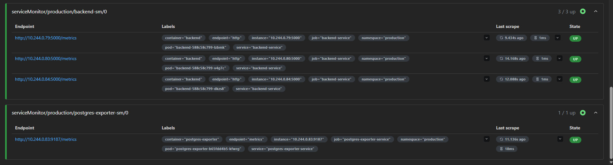
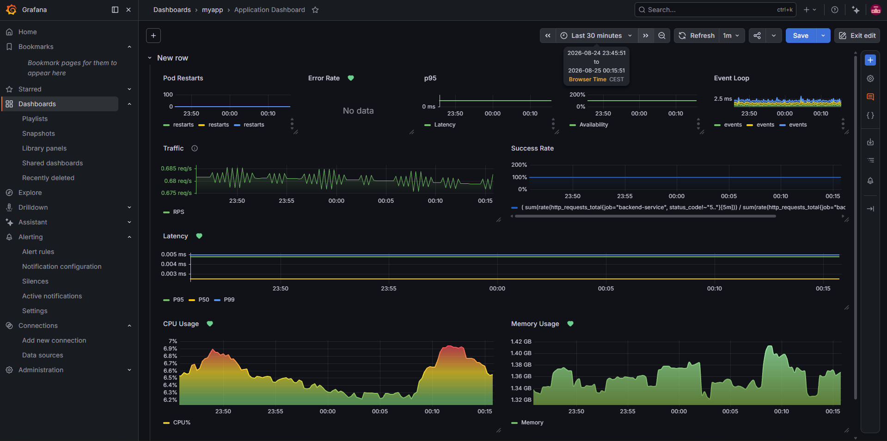
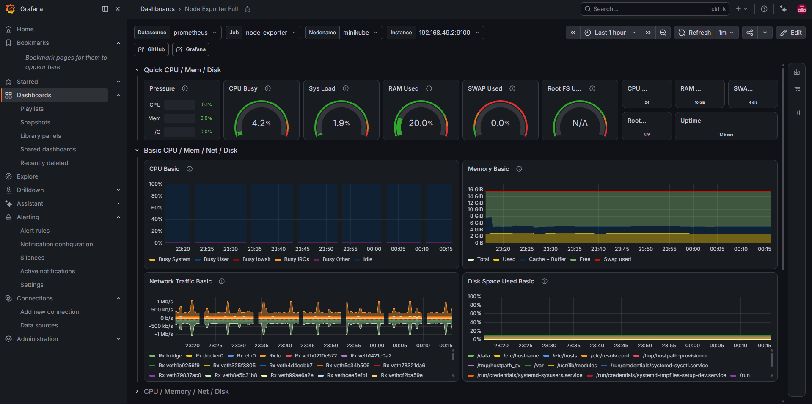
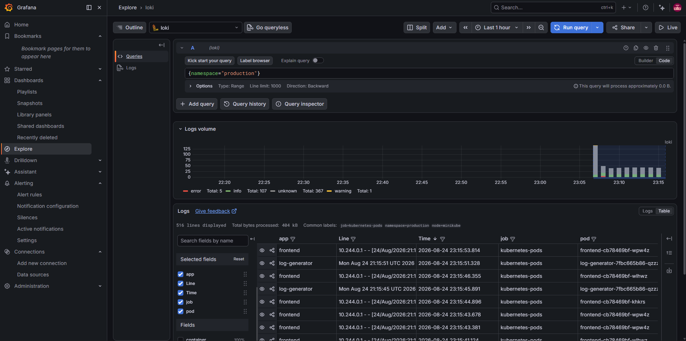

# Kubernetes Observability Platform

Një projekt praktik DevOps që demonstron vendosjen e një aplikacioni me **frontend**, **backend** dhe **PostgreSQL** në Kubernetes, me fokus kryesor te **observability**: metrika, log-e, dashboard-e dhe alarme.
Kodi i frontend-it dhe backend-it është i përfunduar; synimi i këtij repository është të tregojë si një aplikacion mund të monitorohet dhe të operohet në një ambient Kubernetes. Projekti është ndërtuar lokalisht (me Minikube) dhe nuk përdor cloud provider me qëllim: fokusi ka qenë në ndërtimin dhe verifikimin e stack-ut të observability, pa shtuar kompleksitet infrastrukturor nga cloud-i.


## Çfarë përfshin projekti

- **Frontend** statik i shërbyer përmes Nginx, i vendosur me 3 replika dhe HPA.
- **Backend** Node.js/Express me endpoint-e `/hello`, `/health` dhe `/metrics`; ekspozon metrika të aplikacionit me `prom-client`.
- **PostgreSQL** në `StatefulSet`, me ruajtje persistente për të dhënat.
- **Kubernetes production manifests**: `Deployment`, `Service`, `ConfigMap`, `Secret`, `StatefulSet`, `PersistentVolume`, `PersistentVolumeClaim`, probes dhe resource requests/limits.
- **Autoscaling** për frontend dhe backend bazuar në CPU/memorie.
- **Prometheus** për mbledhjen e metrikave të aplikacionit dhe infrastrukturës.
- **Postgres Exporter** për metrikat te databazes.
- **Grafana Alloy** për zbulimin e pod-eve dhe dërgimin e log-eve Kubernetes në Loki.
- **Loki** për centralizimin dhe kërkimin e logs.
- **Grafana** për vizualizim dhe eksplorim të metrikave/log-eve.
- **PrometheusRule** për alarme të error rate, CPU, memories dhe p95 latency.


## Observability

### Metrics
Prometheus zbulon target-et e aplikacionit përmes `ServiceMonitor`-eve dhe i mbledh ato çdo 15 sekonda:

- Backend: kërkesat HTTP, kohëzgjatja e kërkesave, CPU, memorie dhe metrika standarde të procesit.
- PostgreSQL: metrika të ekspozuara nga `postgres-exporter`.
- Kubernetes node: metrika nga Node Exporter.

### Logs
Grafana Alloy përdor Kubernetes service discovery për të gjetur pod-et, u shton label-e të dobishme (`namespace`, `pod`, `container`, `node`, `app`) dhe i dërgon logs në Loki. Kjo e bën të mundur filtrimin e log-eve sipas namespace-it, aplikacionit ose pod-it direkt nga Grafana.

### Dashboards

- **Node Exporter Full**: dashboard i importuar, i përdorur për shëndetin e node-it—CPU, memorie, disk dhe trafik rrjeti.
- **Application Dashboard**: dashboard i ndërtuar nga zero për këtë projekt. Ai përqendrohet te pod restarts, error rate, p95/P50/P99 latency, availability, event loop, traffic/RPS, success rate, CPU dhe memory usage të aplikacionit.

## Prova e funksionimit

### Prometheus targets

Target-et e backend-it dhe `postgres-exporter` janë `UP`, çka verifikon mbledhjen e metrikave nga Prometheus.



### Application Dashboard i ndërtuar nga zero

Dashboard-i i aplikacionit vizualizon trafikun, success/error rate, latency percentile, CPU dhe memorie.



### Node Exporter dashboard i importuar

Dashboard-i i importuar paraqet metrikat e node-it Kubernetes, përfshirë CPU, RAM, disk dhe network traffic.



### Loki logs në Grafana

Log-et e pod-eve të namespace-it `production` janë të disponueshme dhe të kërkueshme në Loki përmes Grafana Explore.



## Struktura e repository-t

.
├── backend/                 # Node.js / Express API dhe Prometheus metrics
├── frontend/                # UI statik dhe konfigurimi Nginx
├── k8s/
│   ├── backend/             # Deployment, Service, HPA, ServiceMonitor
│   ├── frontend/            # Deployment, Service dhe HPA
│   ├── postgres/            # StatefulSet, Service dhe persistent storage
│   ├── exporter/            # PostgreSQL Exporter dhe ServiceMonitor
│   ├── log-generator/       # Pod ndihmës për gjenerim log-esh
│   ├── promRules/           # Prometheus alert rules
│   └── values/              # Helm values për Loki dhe Grafana Alloy
└── docs/images/             # Screenshots që verifikojnë funksionimin


## Nisja e projektit lokalisht

### Kërkesat

- Kubernetes cluster lokal (p.sh. Minikube)
- `kubectl`
- Helm 3
- Docker (nëse rindërtohen imazhet)

### 1. Krijo namespace-et

```bash
kubectl apply -f k8s/namespace.yaml
kubectl apply -f k8s/monitoring-namespace.yaml
```

### 2. Instalo stack-un e monitorimit

```bash
helm repo add prometheus-community https://prometheus-community.github.io/helm-charts
helm repo add grafana https://grafana.github.io/helm-charts
helm repo update

helm upgrade --install monitoring prometheus-community/kube-prometheus-stack \
  --namespace observability

helm upgrade --install loki grafana/loki \
  --namespace observability \
  --values k8s/values/loki-values.yaml

helm upgrade --install alloy grafana/alloy \
  --namespace observability \
  --values k8s/values/alloy-values.yaml
```

### 3. Vendos aplikacionin dhe konfigurimet e observability

```bash
kubectl apply -f k8s/postgres/
kubectl apply -f k8s/backend/
kubectl apply -f k8s/frontend/
kubectl apply -f k8s/exporter/
kubectl apply -f k8s/log-generator/
kubectl apply -f k8s/promRules/
```

### 4. Verifiko deployment-in

```bash
kubectl get pods -n production
kubectl get servicemonitors -n production
kubectl get hpa -n production
kubectl get prometheusrules -n observability
```

Për të hapur Grafana lokalisht, përdor port-forward te shërbimi Grafana i krijuar nga Helm release-i `monitoring`:

```bash
kubectl port-forward -n observability svc/monitoring-grafana 3000:80
```

Pastaj hape `http://localhost:3000`. Në Grafana, përdor Prometheus për metrics dhe Loki për logs.


## Shënime

- Konfigurimet e secrets në manifestet aktuale janë të destinuara për ambient lokal/demonstrues. Për një ambient production, kredencialet duhet të ruhen në një secret manager dhe jo në repository.
- `PersistentVolume` përdor `hostPath`, i përshtatshëm për cluster lokal. Në cloud, storage duhet të ofrohet nga `StorageClass` i provider-it.

## Qëllimi

Ky projekt tregon një workflow të plotë observability në Kubernetes: nga aplikacioni që ekspozon metrika, te Prometheus që i mbledh, exporter-i që monitoron PostgreSQL, Alloy që dërgon log-et në Loki dhe Grafana që i kthen të gjitha në dashboard-e të përdorshme për operim dhe diagnostikim.
